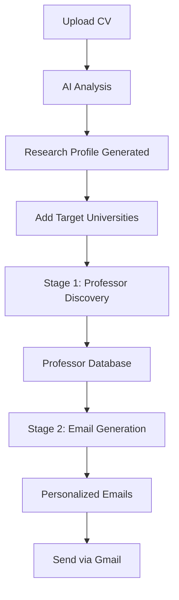

# 🎓 PhD Outreach Automation - 2-Stage System

A comprehensive automation tool for PhD applications that intelligently discovers professors and generates personalized outreach emails using AI.

## 🚀 Features

### 📊 **2-Stage AI System**
- **Stage 1**: Cost-effective professor discovery using GPT-4o-mini
- **Stage 2**: High-quality personalized email generation using GPT-4
- Smart cost optimization with targeted AI model usage

### 🔍 **Professor Discovery**
- Automated web scraping of university faculty pages
- AI-powered research interest alignment scoring
- Duplicate detection and management
- Comprehensive professor database with SQLite

### ✉️ **Email Generation & Management**
- Personalized email drafting based on research alignment
- Professional email templates with customization
- Bulk email generation and sending capabilities
- Gmail API integration for seamless email delivery

### 📄 **CV Analysis**
- Automated CV parsing and analysis using PyPDF2
- AI-generated research profile extraction
- Persistent research profile storage
- Automatic alignment matching with professors

### 💰 **Cost Tracking**
- Real-time API usage and cost monitoring
- Daily and total cost breakdowns
- Stage-wise cost analysis (Stage 1 vs Stage 2)
- Transparent pricing with detailed logs

### 🎨 **Modern UI/UX**
- Streamlit-based web interface
- Modal dialogs for spacious email editing
- Real-time progress tracking
- Responsive design with custom CSS styling

## 🛠️ Installation

### Prerequisites
- Python 3.8 or higher
- Gmail account with API access
- OpenAI API key

### Setup Steps

1. **Clone the repository**
   ```bash
   git clone https://github.com/aakash-priyadarshi/phd-apply-agent.git
   cd phd-apply-agent
   ```

2. **Create virtual environment**
   ```bash
   python -m venv phd_outreach_env
   
   # On Windows
   .\phd_outreach_env\Scripts\activate
   
   # On macOS/Linux
   source phd_outreach_env/bin/activate
   ```

3. **Install dependencies**
   ```bash
   pip install -r requirements.txt
   ```

4. **Environment setup**
   ```bash
   # Copy and configure environment file
   cp .env.example .env
   
   # Edit .env with your API keys
   OPENAI_API_KEY=your_openai_api_key_here
   USER_NAME=Your Full Name
   USER_EMAIL=your.email@example.com
   ```

5. **Gmail API setup**
   - Go to [Google Cloud Console](https://console.cloud.google.com/)
   - Create a new project or select existing one
   - Enable Gmail API
   - Create OAuth 2.0 credentials
   - Download `credentials.json` and place in project root

6. **Run the application**
   ```bash
   streamlit run streamlit_app.py
   ```

## 📖 Usage Guide

### Getting Started

1. **Launch the app** and navigate to `http://localhost:8501`
2. **Enter your OpenAI API key** in the sidebar
3. **Upload your CV** and let AI analyze your research profile
4. **Configure target universities** in the main interface
5. **Run Stage 1** to discover relevant professors
6. **Run Stage 2** to generate personalized emails
7. **Send emails** individually or in bulk

### Workflow Overview



### Key Features Walkthrough

#### 🎯 **Target Universities**
- Add universities with specific departments
- Set priority levels and research focus
- Track progress per university

#### 🔍 **Professor Discovery (Stage 1)**
- Automated faculty page scraping
- AI-powered alignment scoring (1-10 scale)
- Filters professors with score ≥ 6.0
- Cost-effective using GPT-4o-mini

#### ✉️ **Email Generation (Stage 2)**
- High-quality personalization using GPT-4
- Research-specific content alignment
- Professional templates and formatting
- Subject line optimization

#### 📤 **Email Management**
- Individual email preview and editing
- Bulk generation and sending
- Rate limiting and delay controls
- Gmail integration with attachment support

## 🏗️ Architecture

### Technology Stack
- **Frontend**: Streamlit with custom CSS
- **Backend**: Python with async processing
- **Database**: SQLite for data persistence
- **AI Models**: OpenAI GPT-4 and GPT-4o-mini
- **Email**: Gmail API integration
- **Web Scraping**: BeautifulSoup + Requests

### Project Structure
```
phd-apply-agent/
├── streamlit_app.py          # Main application
├── gmail_manager.py          # Gmail API integration
├── requirements.txt          # Python dependencies
├── credentials.json          # Gmail API credentials
├── .env                      # Environment variables
├── phd_outreach.db          # SQLite database
├── uploaded_cv.pdf          # User's CV
├── research_profile.txt     # AI-generated profile
└── README.md               # Documentation
```

### Database Schema
```sql
-- Professors table
CREATE TABLE professors (
    id INTEGER PRIMARY KEY,
    name TEXT NOT NULL,
    university TEXT NOT NULL,
    department TEXT,
    email TEXT,
    research_interests TEXT,
    alignment_score REAL,
    collaboration_potential TEXT,
    status TEXT DEFAULT 'pending',
    draft_email_subject TEXT,
    draft_email_body TEXT,
    stage1_cost REAL DEFAULT 0.0,
    stage2_cost REAL DEFAULT 0.0,
    created_at TEXT
);

-- Cost tracking table
CREATE TABLE cost_tracking (
    id INTEGER PRIMARY KEY,
    date TEXT NOT NULL,
    stage1_cost REAL DEFAULT 0.0,
    stage2_cost REAL DEFAULT 0.0,
    total_cost REAL DEFAULT 0.0,
    professors_processed INTEGER DEFAULT 0,
    emails_generated INTEGER DEFAULT 0,
    created_at TEXT
);
```

## 💡 Best Practices

### Cost Optimization
- Use Stage 1 for bulk professor discovery
- Run Stage 2 only for high-scoring professors
- Monitor daily cost limits
- Review alignment scores before email generation

### Email Quality
- Upload a comprehensive CV for better analysis
- Review and edit generated emails before sending
- Use appropriate delay between bulk emails (5-10 seconds)
- Personalize subject lines for better response rates

### Success Tips
- Target 15-20 professors per university
- Focus on recent publications and research alignment
- Keep emails concise but specific
- Follow up appropriately (not included in this tool)

## 🔧 Configuration

### OpenAI Models & Pricing
- **GPT-4o-mini**: $0.150 per 1K input tokens, $0.600 per 1K output tokens
- **GPT-4**: $30.00 per 1K input tokens, $60.00 per 1K output tokens

### Gmail API Limits
- 250 quota units per user per 100 seconds
- 1 billion quota units per day
- Rate limiting implemented in the app

### Environment Variables
```env
OPENAI_API_KEY=your_openai_api_key
USER_NAME=Your Full Name
USER_EMAIL=your.email@example.com
GMAIL_CREDENTIALS_PATH=credentials.json
```

## 🐛 Troubleshooting

### Common Issues

#### Gmail Authentication
```bash
# Re-authenticate if token expires
rm gmail_token.pickle
# Restart app and complete OAuth flow
```

#### Database Issues
```bash
# Reset database if corrupted
rm phd_outreach.db
# Restart app to recreate tables
```

#### Cost Tracking Errors
```bash
# Run database structure test
python test_db_structure.py
```

#### CV Analysis Problems
```bash
# Check CV file and research profile
python test_persistence.py
```

### Error Messages
- `"JSON parse error"` → Fixed with control character cleaning
- `"No such column"` → Database schema updated automatically
- `"SSL error"` → Gmail connection retry logic implemented
- `"Please enter name"` → Settings validation using session state

## 🔒 Security & Privacy

### Data Protection
- Local SQLite database (no cloud storage)
- Gmail credentials stored locally
- CV content processed locally
- OpenAI API calls with minimal data exposure

### API Key Security
- Environment variables for sensitive data
- `.env` file excluded from git
- No hardcoded credentials

### Rate Limiting
- Built-in delays between API calls
- Gmail sending rate limits respected
- Cost monitoring to prevent overuse

## 🤝 Contributing

### Development Setup
```bash
# Clone and setup development environment
git clone https://github.com/aakash-priyadarshi/phd-apply-agent.git
cd phd-apply-agent
python -m venv venv
source venv/bin/activate  # or venv\Scripts\activate on Windows
pip install -r requirements.txt
```

### Testing
```bash
# Test database structure
python test_db_structure.py

# Test Gmail setup
python verify_gmail_setup.py

# Test CV persistence
python test_persistence.py
```

### Code Style
- Follow PEP 8 guidelines
- Use type hints where applicable
- Add docstrings for functions
- Comment complex logic

## 📝 Changelog

### Version 2.0.0 (Latest)
- ✅ Fixed JSON parsing errors in bulk email generation
- ✅ Implemented modal dialogs for email editing
- ✅ Added CV and research profile persistence
- ✅ Enhanced cost tracking with proper database queries
- ✅ Improved settings validation with session state
- ✅ Added duplicate professor detection and cleanup
- ✅ Enhanced error handling and user feedback
- ✅ Fixed Gmail SSL connection issues

### Version 1.0.0
- Initial release with basic functionality
- Professor discovery and email generation
- Gmail integration and cost tracking

## 📧 Support

### Getting Help
- Create an issue on GitHub for bugs
- Check troubleshooting section first
- Include error logs and steps to reproduce

### Feature Requests
- Open a GitHub issue with enhancement label
- Describe use case and expected behavior
- Consider contributing code if possible

## 📄 License

This project is licensed under the MIT License - see the [LICENSE](LICENSE) file for details.

## 🙏 Acknowledgments

- OpenAI for powerful language models
- Google for Gmail API access
- Streamlit for excellent web framework
- BeautifulSoup for web scraping capabilities
- SQLite for reliable local database

---

## 🎯 Quick Start Command

```bash
# One-command setup (after cloning)
pip install -r requirements.txt && streamlit run streamlit_app.py
```

**Happy PhD hunting! 🎓✨**

---

*Built with ❤️ for aspiring PhD students worldwide*
