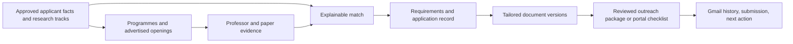

# PhD application CMS: 2026–27 implementation plan

## Product decision

Evolve the existing Python, Streamlit, SQLite, and Gmail application. Preserve its CV upload, two-stage discovery/drafting loop, editable email preview, cost ledger, and Gmail sender. Build one local operator console that answers: **what opportunity is open, why am I a fit, what evidence supports that, what must I submit, what did I send, and what is next?**

The immediate priority is a usable application pipeline for the 2026–27 cycle. Advertised positions, programme deadlines, and document requirements belong near the start of the roadmap, rather than in the final phase. A recent paper establishes research context; it does **not** establish that a professor is recruiting.

## Baseline from `main` at `1bcb632d`

| Area | Status | Evidence / consequence |
| --- | --- | --- |
| Streamlit operator workflow | Partial | CV upload, target list, Stage 1, draft/edit/send, and cost display exist in `streamlit_app.py`. |
| Gmail sending | Current, with safety work needed | `gmail_manager.py` sends MIME email with optional CV and retries; it stores OAuth credentials with pickle and requests read scope before using it. |
| Repository privacy | Security issue | Git tracks `credentials.json`, `uploaded_cv.pdf`, `phd_outreach.db`, and a compiled config file despite ignore rules. Removing them from the next commit will not erase history. |
| Applicant profile and claims | Partial / missing | The app converts the first part of a CV PDF into one text profile. It has no approved facts, versioned research tracks, or fact/aspiration distinction. |
| Faculty discovery | Broken for most targets | The live URL map covers MIT, Stanford, and Oxford; the target CSV has eight universities. Unmapped departments silently yield no candidates. |
| Professor verification | Missing | The current `verified` status is set from an LLM alignment threshold, without independent source evidence. |
| Research publications and matching | Missing / unreliable | No publication API; an LLM produces an opaque 1–10 fit score. |
| Open positions and programme requirements | Missing | No openings, deadline, eligibility, contact policy, portal, or document requirement record. |
| Tailored CV, SOP, proposal, cover letter | Missing | Gmail can attach only the uploaded CV; there is no document version or package manifest. |
| Application CRM and inbox history | Missing | The old DB has 156 professor rows, zero `sent_emails` rows, and no application or reply workflow. Zero sends *in this database* does not prove that no contact happened elsewhere. |
| Tests and setup | Broken | Manual test scripts include a real-send script; `requirements.txt` lists Python standard-library modules and unused Selenium. |

This audit reads code and database structure only. The 156 historical professors are seed records that must be rechecked before use. Do not print or publish their personal data.

## Core workflow

### 1. Applicant truth library

Extract CV, projects, patents, publications, prior proposals, and manually entered research interests into an editable, versioned applicant profile. Each approved profile version is immutable and has its own claim-state snapshot, so a later CV edit cannot change the facts that supported an earlier email or application. Keep each usable claim with type (`FACT`, `INFERENCE`, `ASPIRATION`), original source, status, and approval for outreach. Research tracks should describe the applicant's genuine directions, with reusable project and method evidence. Generated text may select or rephrase approved material, but any new factual wording requires review.

### 2. Opportunity-first discovery

Represent three distinct routes: **advertised funded position**, **programme application**, and **faculty enquiry**. Search official university, department, lab, and admissions pages first. Add curated sources such as [EURAXESS jobs](https://euraxess.ec.europa.eu/jobs/search) for discovery, then confirm application instructions on the host institution's page. Use a compliant search provider when a target lacks a known URL. Use OpenAlex to identify and inspect recent works, not to infer vacancies; its [API supports author work queries ordered by publication date](https://help.openalex.org/how-to/api-recipes/).

For each opportunity store: canonical URL, institution/programme/lab, supervisor if named, research area, funding and eligibility as stated, deadline **with timezone**, how to apply, whether pre-contact is required/allowed/discouraged, `OPEN`/`CLOSED`/`UNKNOWN`, source excerpt, retrieval time, and last manual verification. Preserve an append-only source snapshot with canonical URL, retrieved time, relevant excerpt, content hash, and verification state. A changed page creates a new snapshot; it never rewrites the evidence used by an old package. Expired or changed listings move to a review queue. A paper or active project is never labelled an open position without an opening source.

Use one configurable freshness policy for professor affiliation, professor email, openings, deadlines, programme requirements, contact policy, and publication context. Initial review intervals to tune after pilot: affiliation/email 45 days, advertised opening 3 days, deadline 7 days, requirements/contact policy 14 days, and publication context 30 days. These intervals prompt rechecking; they do not turn a page into proof that a professor is accepting students. Show last checked time and freshness state in the UI; stale critical facts block a send or submission-ready claim until reviewed.

### 3. Evidence-backed matching

Deduplicate people by official profile plus institution, with email as a secondary key. Reverify the old 156 rows. Resolve the correct OpenAlex author before associating papers; same-name authors need manual review. Start research-fit scoring with configurable topic (30%), method (20%), recent work (20%), demonstrated applicant experience (20%), and proposed direction (10%). Show each component and its source, then calibrate weights on a small human-reviewed set. Treat unknown supervision availability as `UNKNOWN`, rather than as a rejection or confirmation. Persist and display **Research Fit** and **Application Readiness** (opening, eligibility, deadline, contact route) as two separate measures. Show unknown inputs and evidence coverage beside each number; do not silently score missing facts as zero or as confirmed. Never collapse the measures into one score. Document/package completeness is a third, administrative measure and is not an admission probability.

### 4. Application and document CMS

Each application record links a programme or opening, possible supervisors, deadline, portal, funding, eligibility, status, owner action, and sourced requirements. Requirement values are `REQUIRED`, `OPTIONAL`, `NOT_REQUESTED`, or `UNKNOWN`; include page/word limit, file format, filename rule, upload field, source, and checked date. Record whether a requirement applies to **faculty outreach**, the **formal application**, or a **reply request**; an SOP required by a portal is not automatically an email attachment. Position-specific instructions take precedence over general programme guidance, and any conflict becomes a manual review item. `UNKNOWN` must remain visible until checked. Track reference letters, transcripts, tests, fees, and funding forms as tasks, even when the document itself is submitted by a third party.

Keep one approved master CV and a bank of approved bullet points. A CV variant may select, order, and emphasize relevant work for a professor or position; it must preserve factual dates, roles, results, publication status, and patent status. Render a PDF, display the diff from master, and record approval. Build SOP and proposal variants from reusable research/story sections, matched papers, and exact programme constraints. Preserve the applicant's proposed contribution; do not rewrite interests simply to mirror the lab. Hash and freeze each file sent or uploaded.

Use a local document store under `data/documents/` initially and an SQLite manifest containing class, type, version, application, source/master version, hash, sensitivity, storage locator, approval state, and submission/sent timestamp. Export a human-readable folder per application with the final files and a checklist; do not rely on filenames as the database. The Document Vault addendum below defines source records, master content, generated variants, and the package builder.

### 5. Outreach and application assistance

Draft an email from approved applicant claims, verified professor evidence, a real opportunity or supervision route, and the exact approved attachment manifest. Require the draft to return claim IDs and source IDs. A deterministic gate checks those IDs, names/institutions, required files, paper identifiers, placeholders, duplicate contact, and stale critical evidence. The reviewer checks meaning and tone because an ID check alone cannot prove that a paraphrase is accurate. Human review of the complete package is the default before sending.

Before first outreach, reconcile Gmail Sent history and allow manual imports for messages sent outside the app. The [Gmail API can query messages and retrieve their `threadId`](https://developers.google.com/workspace/gmail/api/guides/list-messages); store message and thread IDs with the package snapshot. A database idempotency key prevents local duplicate queue entries, while an ambiguous Gmail send response must be reconciled against Sent before retrying. Automatic retries alone cannot guarantee exactly-once email delivery.

For application portals, maintain an approved answer library (education, dates, research interests, awards, referees) and a form-field checklist. Start with copy-ready answers and supervised filling of supported fields; show the source for each value and require a final review of the portal's confirmation page. Keep submission and payment as explicit user actions. Store the portal confirmation number, submission time, and a copy of the final package.

## First screens

1. **Today:** deadlines, recently changed openings, stale evidence, document alerts, reviews needed, replies, and next actions.
2. **Opportunities:** open/unknown/closed, eligibility, deadline, source freshness, separate research fit and application readiness, and application route.
3. **Professor detail:** current affiliation, evidence, relevant papers, availability status, contact history, package requirements, and next action.
4. **Application detail:** sourced requirements matrix, Document Vault selections, administrative completeness, referee status, portal answers, and submission history.
5. **Outreach review:** side-by-side email, source/claim citations, actual files, quality gate results, and approve/send controls.

## Incremental implementation

| Slice | Deliverable | Done when |
| --- | --- | --- |
| 0. Safety and baseline | Create a development branch; back up the DB; move runtime data to ignored `data/`; untrack credentials/CV/DB; rotate the exposed OAuth client; use JSON OAuth tokens; simplify setup; make sending review-only by default. | Existing UI still starts, old data survives locally, no private runtime file is tracked, and normal tests cannot send email. |
| 1. Application ledger | Add additive migrations, programmes/openings/applications/deadlines/requirements/tasks, and the basic `documents`, `document_versions`, and application-document mapping concepts. Start with local file storage, manual classification, and a simple dashboard with official source links. | A real target can be entered with deadline, requirements, document checklist, available source documents, and next action before any AI discovery works. |
| 2. Applicant truth and discovery | Add versioned applicant profile/claims; expand faculty source catalog; add official-page and opportunity discovery; reverify historical professors; enrich shortlisted people with OpenAlex. | Ten manually checked targets show current source, opportunity status, applicant evidence, and research context; uncertain fields say `UNKNOWN`. |
| 3. Match and documents | Add separate fit/readiness measures, master CV bullets, tailored CV diff/PDF, SOP/proposal sections, requirement-based package selection, frozen application-package export, and immutable versions. | One advertised opening and one programme application each produce a reviewable, compliant package with a manifest and no invented facts. |
| 4. Outreach and memory | Structured email drafting, deterministic quality gate, package snapshot, reviewed queue, Gmail Sent reconciliation, send/thread logging. | No draft can send until its claims, sources, recipient, and exact attachments pass review; the sent package and message ID can be recovered. |
| 5. Portal assistance and follow-through | Answer library, supervised form help, submission records, reply triage, follow-up drafts, and backup/restore. | A complete application can be prepared, submitted by the user, and tracked through reply/outcome with its documents and dates intact. |

Run focused automated tests after each slice and one manual smoke test of the preserved upload → discover → draft → edit flow. Real Gmail integration tests require a separate explicit flag and test mailbox. Begin with a small reviewed batch rather than a full-faculty send.

## Migration and code shape

Use additive, versioned SQLite migrations. First preserve the legacy DB byte-for-byte in an ignored local backup. Then add `schema_migrations`; extend `professors` with verification/contact fields while retaining old columns; mark historical rows `needs_reverification=1`. Plan tables in dependency order, creating them only in the slice that uses them:

| Slice | Entities |
| --- | --- |
| 1 | `programmes`, `opportunities`, `applications`, `deadlines`, `requirements`, `application_tasks`, `documents`, `document_versions`, `application_documents`, `source_evidence`; `campaigns` and `campaign_policies` may be schema-only with auto-send disabled. |
| 2 | `applicant_profiles` with immutable profile versions, `claims` with approval/version history, `research_tracks`, `research_track_versions`, `publications`, `match_assessments`. |
| 3 | `proposal_variants`, `application_packages`, `package_documents` and package manifests. |
| 4 | `campaign_dry_runs`, `outreach_packages`, `outreach_messages`, `outreach_attempts`, `gmail_threads`, `reply_events`. Reply-generated actions use `application_tasks`. |

`source_evidence` is append-only at the application level and stores canonical URL, `retrieved_at`, relevant excerpt, content hash, source type, and verification state. Match assessments store separate research-fit and application-readiness values plus component evidence, without a combined score. Every outreach/application package references the exact approved applicant profile version, claim states, source snapshots, requirement snapshot, and document hashes used. Preserve `cost_tracking`; start writing message records instead of relying only on `professors.status`. Use transactions, foreign keys, uniqueness rules for canonical URLs and outreach keys, and a tested rollback-from-backup procedure.

Extract existing responsibilities incrementally into a small `phd_agent/` package: `config`, `db`, `profile`, `discovery`, `matching`, `documents`, `outreach`, `applications`, and `ui`. Keep `streamlit_app.py` as the entry point until the operator workflow is stable. Share a single evidence model between discovery, matching, requirements, and drafting. Use typed LLM outputs where supported; [OpenAI's Structured Outputs supports schema-based extraction](https://platform.openai.com/docs/guides/structured-outputs). Keep model names and prices in configuration so they can be refreshed without editing each workflow.

## Decisions that keep this build practical

- Move openings and basic CRM ahead of elaborate email automation because deadlines determine the next action.
- Start with curated official source URLs and targeted search. Add a browser renderer only for specific pages that require JavaScript.
- Calibrate matching weights on a small human-reviewed set. Avoid a vector database until ordinary topic/method matching demonstrably fails.
- Begin with editable proposal/SOP sections and CV variants. Add more elaborate generation only after the basic package reliably follows requirements.
- Keep review-before-send as the release default. Add auto-send only after contact reconciliation, quality gates, rate limits, and send recovery have been proven on a small pilot.
- Keep portal filling supervised. Each institution's form and instructions can change, so the application record and final review carry the truth.

## Success measures for this cycle

- Every active target has a source-backed deadline, application route, and next action.
- Every recommended professor has a current affiliation source and a visible research-fit explanation; availability may explicitly be unknown.
- Every generated claim in an email or document links to approved applicant evidence or verified external evidence.
- Every sent or submitted package can be reconstructed from frozen versions and hashes.
- The dashboard can answer which applications are incomplete, what is due in 7/14/30/60 days, and what reply requires action.
- No credential, CV, token, local DB, generated document, or portal answer enters Git again.

## Addendum — research proposals, package policy, and outreach automation

This addendum extends the application-first roadmap above. Slice 0 and Slice 1 remain the first implementation work. The research-track and proposal features belong with applicant profile and document slices; campaign dry runs and sending belong with the outreach slice.

### A. Master research direction library

Create versioned `research_tracks` for the applicant's genuine PhD directions. Initial tracks can include trustworthy AI, LLM/agent evaluation, knowledge-grounded AI and RAG, multimodal/embodied AI, and AI with robotics or human augmentation. These are editable starting points, not claims that the applicant has already worked in every area.

Each track stores a title, research problem, motivation, gap, questions, hypotheses, methodology, evaluation strategy, possible datasets/environments, expected contribution, related projects, approved applicant claim IDs, prior work/references, limitations, open questions, approval state, and version. A professor-specific proposal must name one approved master track. The system must not generate an unrelated research identity for each professor.

### B. Proposal variants and change record

Support a short research statement, approximately 500-word concept note, one-, two-, or three-page proposal, full proposal, and institution-provided template when required. A variant records its `research_track_id`, professor/application/opportunity, requirement source, length and format constraints, professor publication IDs, applicant claim IDs, generated and manually edited sections, approval state, version, and final PDF hash.

Show a structured master-to-variant diff: changed framing, related work, experiment emphasis, or collaboration angle; unchanged core research question, applicant motivation, and main methodological direction. Every cited paper and external claim must resolve to stored source evidence. A reviewer approves the final variant before use.

### C. Deterministic package policy

Requirements and attachment decisions must carry one of three contexts: `FACULTY_OUTREACH`, `FORMAL_APPLICATION`, or `REPLY_REQUEST`. The package policy selects files from sourced requirements and configured defaults, then records the reason for every included or excluded document. An SOP required for the formal portal does not become an initial email attachment.

Supported outreach packages are CV only; CV plus cover letter; CV plus research proposal; CV plus both; or an explicitly requested custom set. Show document type, requirement state, context, source, last verification time, selected version, and selection reason. Unknown or conflicting requirements create a review task. The LLM may describe a proposed package but cannot decide attachments.

### D. Outreach grounding contract

Build a typed `OutreachContext` with verified professor identity and affiliation, department/lab, research evidence and relevant publications, approved applicant research track and claims, relevant project/result/method, programme or opening, contact policy, previous contact, and the exact document manifest.

Typed email output must return `subject`, `body`, `candidate_claim_ids`, `professor_evidence_ids`, `publication_ids`, `attachments_mentioned`, and `risk_flags`. The quality gate checks that every returned ID exists, is approved or verified for its use, and matches the final package. It also checks names, institution, placeholders, duplicate contact, length, and attachment mentions. A human reviewer checks the factual meaning of paraphrases and the tone.

### E. Default initial email style

Aim for approximately 120–170 words unless the professor's instructions call for another format. Include a correct greeting, brief introduction, one concrete research observation, one strong applicant experience, a concise connection to the master research direction, one clear supervision/application question, an accurate attachment sentence, and a professional close. Avoid generic prestige language, inflated praise, unrelated project lists, and mini-SOP emails.

### F. Campaign and automation model

Design `campaigns` and `campaign_policies` during the early schema work even while sending remains review-only. Store campaign name, cycle, included universities/opportunities, status, `auto_send_enabled` (default `false`), minimum research-fit score, required affiliation/email/opportunity/requirement verification, required document and package approval states, daily cap, allowed weekdays, professor-local send window and timezone, minimum/maximum spacing, maximum retries, follow-up delay, pause state, and emergency stop state. Record policy version with every send decision so later changes do not rewrite history.

Auto-send eligibility requires a valid contact route, no prior contact or rejection, no do-not-contact flag, current critical evidence, a passed quality gate, and an approved package. Enabling a campaign requires an explicit operator action; configuration alone cannot silently send. Slice 0 keeps all existing bulk paths in review mode. The automated worker is introduced only after the reviewed queue and reconciliation path have been tested.

### G. Campaign dry run

Before enabling automatic sending, run the same eligibility and package policy without calling Gmail. Show each candidate as `WOULD_SEND` or `BLOCKED`, with reasons such as stale affiliation, unverified email, unknown requirements, missing document, previous contact/rejection, no valid route, or quality-gate failure. Include aggregate counts and policy version. Save the dry-run report for review, and recompute eligibility immediately before any later real send.

### H. Idempotent sending and recovery

Enforce a unique local outreach key such as `campaign_id + professor_id + outreach_stage`; use a transactional state transition before calling Gmail. After an ambiguous API response, reconcile Gmail Sent and the relevant thread before retrying. A local uniqueness key cannot guarantee exactly-once external delivery. Store attempt times, outcomes, Gmail message/thread IDs, and the evidence used to decide whether a retry is safe.

### I. Reply-triggered tasks

Classify replies into positive interest; formal application, proposal, CV, cover letter, additional information, or meeting requested; referral; not accepting students; no funding; rejection; out of office; bounce; and other. Classification creates an explicit next action rather than sending a response automatically.

A document request records the source Gmail message, professor/application context, requested length/template, deadline if stated, and document-generation action. For a proposal request, generate a variant from an approved master track plus verified professor and conversation evidence; then require review before reply. Meeting requests create scheduling tasks, with calendar integration optional later.

### J. Immutable outreach snapshot

For every approved or sent package preserve final subject/body, applicant profile and research-track versions, claim/evidence/publication IDs, document IDs and file hashes, requirement snapshot, quality-gate result, approval timestamp, campaign policy version, and Gmail message/thread IDs after sending. The record must reconstruct exactly what the professor received even if the profile, source page, or master documents change later.

## Addendum — Document Vault and Application Package Builder

Make documents a first-class part of the application CMS. From an application, the operator should see every required item, its source, the approved version selected, what is missing, and the exact materials eventually submitted. The SQLite records and package manifest are authoritative; folders are an export for human use.

### Document model and identity

Support three classes:

- `SOURCE`: institution- or government-issued originals such as transcripts, degree certificates, marksheets, test results, identity documents, patent evidence, and published papers. Never overwrite an original.
- `MASTER`: editable, versioned CV, approved bullet/story/answer libraries, cover letter and personal statement content. Research tracks remain structured records linked to master document versions when a file exists.
- `GENERATED`: application-, opportunity-, or professor-specific CVs, SOPs, proposals, letters, statements, answers, outreach packages, and final application bundles. Each variant links to its exact master/source versions.

Each document version should retain, where applicable: document and version IDs, applicant, class/type/title, issuer/institution/degree, issue and expiry dates, parent version, application/professor/opportunity, original and canonical filenames, MIME type, byte size, SHA-256 hash, sensitivity, verification and approval states, storage backend and object key, upload/generation/approval/submission times, and notes. Keep the institution's original requirement label alongside the normalized document type. Types include CV, SOP, personal statement, research proposal/statement, cover letter, degree, transcript, marksheet, language and standardized tests, passport/government ID, photo/signature, patent, publication, certificate, funding form, application form, portal confirmation, payment receipt, and other.

For a generated CV, SOP, or proposal, also preserve generation context, prompt version, model used, master document version, applicant claim IDs, source evidence IDs, manual edits, `generated_at`, `approved_by`, and `approved_at`. A PDF hash proves which bytes were used; these fields explain how those bytes were produced.

On upload, hash the bytes and offer to reuse an identical existing source file. Linking a transcript to another application must not create another physical copy. Replacing a file creates a new version and leaves old package references intact. Expiry alerts cover identity and test records where relevant.

### Sensitivity and storage

Classify files as `NORMAL`, `CONFIDENTIAL`, or `HIGHLY_SENSITIVE`. Government identity documents default to `HIGHLY_SENSITIVE` and local-only. Store the document's permitted location separately from its actual location. The default backend is an ignored local `data/documents/` directory with a tested backup/restore path. No document, portal answer, or generated package enters Git. If cloud storage for highly sensitive documents is ever enabled, encrypt before upload and keep the encryption key outside the bucket and Git; this is deferred from the first release.

Expose a small `DocumentStorage` interface (put, get, existence, hash verification, export) so document IDs and application records do not depend on local paths. Implement `LocalDocumentStorage` in Slice 1. An `S3CompatibleDocumentStorage` backend, including a Railway Storage Bucket, is a post-deployment enhancement, not a launch blocker. [Railway buckets are private and support presigned access](https://docs.railway.com/storage-buckets), but Railway currently lists no bucket-side server encryption, object versioning, or object locks; the application must retain its own version/backup controls. Highly sensitive files require explicit opt-in and application-side encryption before any cloud upload.

The first hosted Railway deployment uses one Streamlit service, Google OIDC plus an email allowlist, and one volume mounted at `/data` for SQLite and `LocalDocumentStorage`. See [docs/railway-deployment.md](railway-deployment.md). Volumes persist service data but do not support replicas and cause brief deployment downtime. A file designated local-only is unavailable to a hosted instance: build any package requiring it locally, or explicitly change the storage policy.

### Application package policy and build

Map each sourced requirement to an available approved document version. Show requirement state (`REQUIRED`, `OPTIONAL`, `NOT_REQUESTED`, `UNKNOWN`), document state (`AVAILABLE`, `MISSING`, `NEEDS_UPDATE`, `NEEDS_APPROVAL`), context (`FACULTY_OUTREACH`, `FORMAL_APPLICATION`, `REPLY_REQUEST`), source, last checked time, selected version, and reason. Store a condition for conditional requirements such as language evidence; unresolved applicability stays visible as `UNKNOWN`. Track administrative completeness separately from Research Fit and Application Readiness. The primary display is a count such as "required items completed 7/8; unknown requirements 2; conditional requirements 1". A percentage, if shown, is secondary and never an admission probability.

`BUILD APPLICATION PACKAGE` is a reviewed action. Select only approved versions allowed by the current requirement and sensitivity policy. Freeze a manifest with application ID, build time, requirement and source snapshots, included/excluded items and reasons, document IDs/versions/hashes, canonical filenames, package hash, approval and submission states. Generate a checklist and a human-readable local folder; ZIP export is optional. Keep original documents separate. If an institution asks for one combined PDF, assemble it deterministically from approved components in a recorded order while retaining every component and its hash.

CV variants come from the approved master CV and bullet library, with a visible diff and factual values preserved. SOP/personal statement variants come from approved story modules, claims, programme evidence, a selected research track, and exact limits. Proposal variants follow the approved master-track and change-record rules above. A cover letter is generated only when the relevant context requires, requests, or intentionally permits one. All generated versions need review before package selection.

### References and archive

Track referees as application records with institution, email, relationship, invitation time/status, deadline, and submitted time/status. A confidential letter can be marked submitted without pretending that the applicant possesses its file.

When an application is submitted, freeze its package, final portal answers, confirmation number or receipt, timestamp, payment record where applicable, referee state, requirement snapshot, and file hashes. The archive must answer what was submitted even after master documents or university pages change. The Today screen should surface expiring records, missing files, pending approvals, unmapped requirements, and requirement changes that affect an already-built package.

### Reusable application and outreach preflight

Implement one deterministic preflight engine with context-specific rules and structured `PASS`, `WARNING`, or `BLOCK` results, each naming the evidence or missing item. Application preflight checks current deadline and route, reviewed eligibility, requirement applicability, approved documents, word/page and file constraints, claim and citation validity, referee completion, filename/format rules, and frozen hashes. Outreach preflight checks current professor affiliation/email/contact policy, fresh research evidence, prior contact or rejection, approved documents, exact attachment mentions, supported claims and papers, and the email quality gate. The UI presents blockers and warnings before submission or send; only a clean result can be marked ready. Store the rule-set version and preflight result with the package snapshot.
